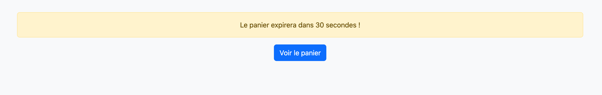
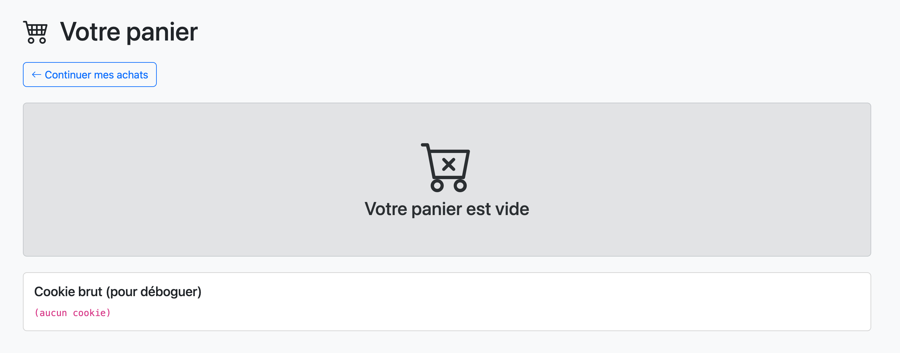

# cookies-serialize-unserialize-setcookie-php-ecommerce
<h1> cookies-serialize-unserialize-setcookie-php-ecommerce </h1>
<h3>Objectifs  </h3>
<ul>
<li> Comprendre ce qu’est un cookie et à quoi il sert </li>
<li>Savoir créer, lire, modifier et supprimer un cookie avec setcookie()  </li>
<li> Utiliser serialize() et unserialize() pour stocker un tableau dans un cookie </li>
<li> Découvrir les paramètres importants (expiration, HttpOnly, durée de vie)</li>
<li> Réaliser un panier d’achat qui reste même après fermeture du navigateur </li>
</ul>

